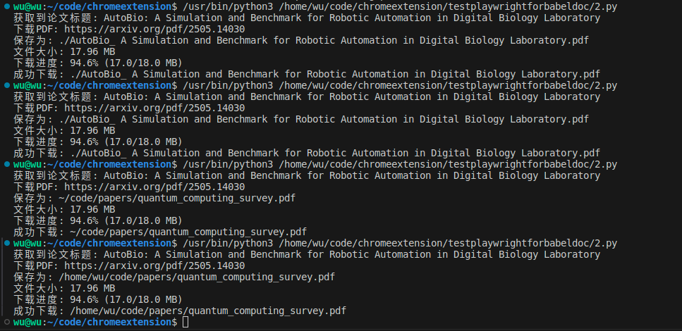

# downloadArxiv
下载Arxiv论文的Python脚本，实现了通过摘要页面URL、PDF URL或论文ID来下载Arxiv上的论文。

# 特点
- **提供多种方式下载Arxiv论文，包括摘要页面URL、PDF URL和仅提供论文ID。**
- **无需手动复制文章标题，自动从摘要页面获取文件名。**
- **文件名如果无效，会进行修正，确保文件名有效。**

# 如何使用

##  安装依赖
```python
pip install requests
pip install pathvalidate
```

##  示例

以下五种方式展示了如何使用`download_arxiv_paper()`函数下载Arxiv论文。

```python
if __name__ == "__main__":
    # 示例1: 通过PDF URL下载并获取标题
    download_arxiv_paper("https://arxiv.org/pdf/2505.14030")
    
    # 示例2: 通过PDF URL下载 (旧格式兼容)
    download_arxiv_paper("https://arxiv.org/pdf/2505.14030.pdf")
    
    # 示例3: 仅提供论文ID
    download_arxiv_paper("2505.14030")
    
    # 示例4: 通过摘要页面URL下载
    download_arxiv_paper("https://arxiv.org/abs/2505.14030")
    
    # 示例5: 自定义文件名和保存目录
    download_arxiv_paper(
        "2505.14030",
        filename="quantum_computing_survey",
        save_dir="/home/wu/code/papers"
    )
```

结果如下

